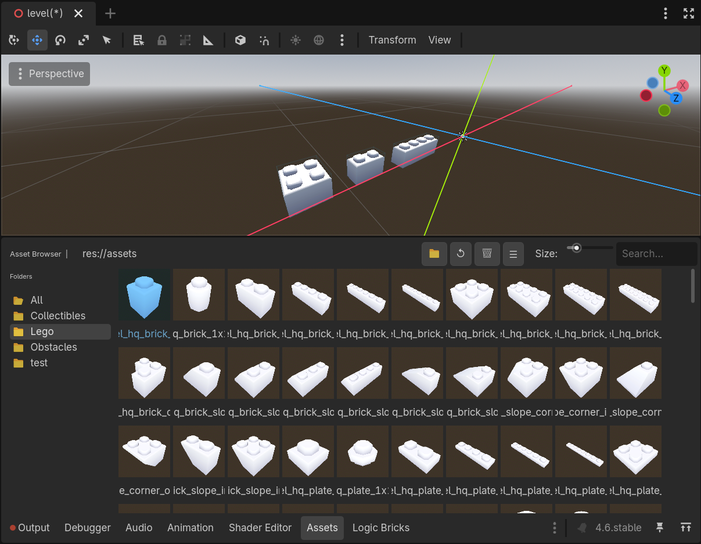

# Asset Browser

A Blender-style asset browser panel for Godot 4. Browse a folder of `.tscn` files, see thumbnail previews, and drag scenes directly into the 2D or 3D viewport.

## Features

- Bottom-panel asset browser with thumbnail previews
- Drag-and-drop scenes into the 3D viewport (raycasts to ground plane) or 2D viewport
- Search/filter by name
- Change the watched folder at any time
- Supports undo/redo
- Duplicate names are numbered automatically (e.g. `Tree`, `Tree2`, `Tree3`)

## Installation

### Via the Godot Asset Library (recommended)

1. Open your project in Godot 4.
2. Go to **AssetLib** tab at the top of the editor.
3. Search for **Asset Browser** and click **Download**.
4. Enable the plugin under **Project → Project Settings → Plugins**.

### Manual

1. Download or clone this repository.
2. Copy the `addons/asset_browser/` folder into your project's `addons/` folder.
3. Enable the plugin under **Project → Project Settings → Plugins**.

## Usage

1. After enabling the plugin, an **Assets** tab will appear in the bottom panel.
2. Click **📁 Change Folder** to point the browser at the folder containing your `.tscn` assets.
3. Click **↺ Refresh** if you add new scenes to the folder.
4. Drag any thumbnail card into the 3D or 2D viewport to instance the scene.
   - In 3D, the node is placed at the point where the camera ray intersects the Y=0 ground plane.
   - In 2D, the node is placed at the mouse position in world space.

## Requirements

- Godot 4.x (developed and tested on 4.6)

## License

MIT License — see [LICENSE](LICENSE) for details.
